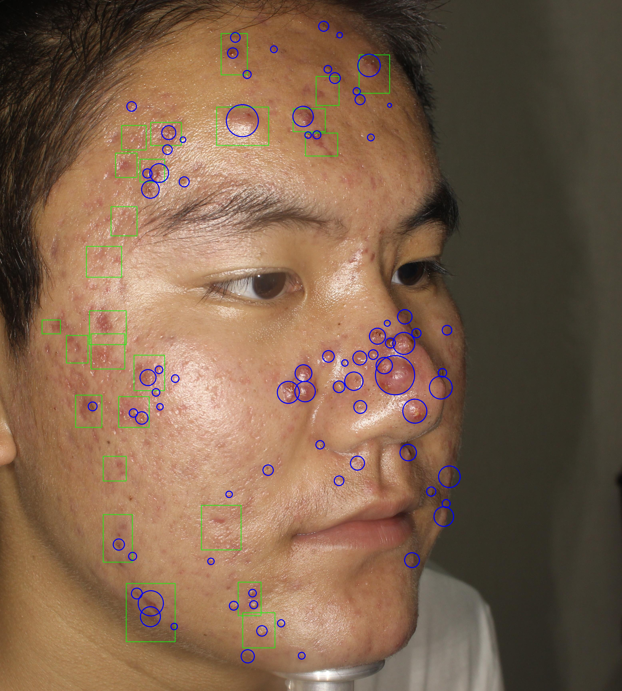

# Acne04-v2 dataset

[ACNE04 dataset](https://github.com/xpwu95/LDL)

`Acne04-v2_annotations.json` is a json format file containing the annotations our experts made for our paper "AcneAI: A new acne severity assessment method using digital images and deep learning" (link soon). We provide new labels for the images  of the open source dataset ACNE04 from the paper  [Joint Acne Image Grading and Counting via Label Distribution Learning, Wu et al. ICCV 2019](https://openaccess.thecvf.com/content_ICCV_2019/html/Wu_Joint_Acne_Image_Grading_and_Counting_via_Label_Distribution_Learning_ICCV_2019_paper.html) released in 2019. In order to provide a better quality dataset, we removed the low quality images and asked our experts to annotate more acne lesions. 

The news version of the dataset contains 1204 images and 32 443 annotations, and corresponds to a subset of the acne04 first version.  **For now, we only published a sample of the annotations, but the whole dataset will be published after acceptation of our paper.**

The format of the json file is inspired from the COCO annotations format.

- **"images"** is a list of dictionnaries, each element corresponding to one image. Each dictionnary is composed of several fields : image `id` , name of the image `file_name`, and image size information (`height` and `width`).
- **"annotations"** is a list of dictionnaries, each element corresponding to one acne lesion. Basically, for each image, there are several annotations related. The different fields of each dictionnary are : annotation `id`, `image_id` which is the id in the of the source image in the **"images"** corresponding dictionnary, center `coordinates` and `radius` of the acne lesion on the image.
- **"info"** is a dictionnary containing information about this file : the predictions `version`, a brief `description`, the release `year`, and the names of the `contributors`.

The file `draw_acne_from_json.py` is one example of how to plot the circles of acne on the images. In the folder *examples/*, we provide samples of annotated images (in green the ruler lines and in red the rectangle which heigt corresponds to the 1 mm scale of the image).

 
